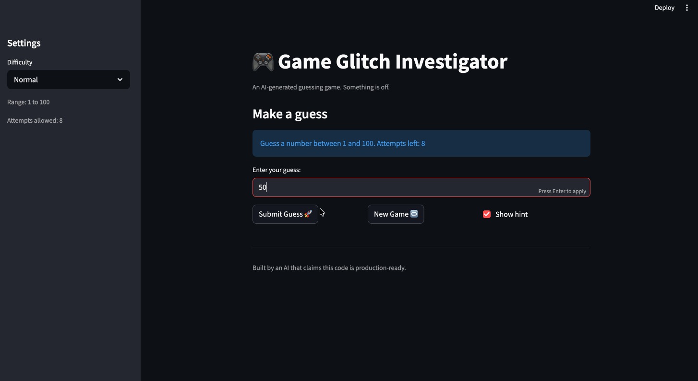

# 🎮 Guided Guess

## Project Update
This started as a debugging project where I had to fix a broken number guessing game. I ended up turning it into a more complete system by fixing the logic, cleaning up how the game resets, and improving the feedback the user gets when guessing.

## Setup

1. Install dependencies: `pip install -r requirements.txt`  
2. Run the app: `python3 -m streamlit run app.py`

## What the Game Does

The game generates a random number based on the difficulty level. You try to guess the number within a limited number of attempts.

Instead of just saying higher or lower, the game now also tells you how close your guess is.

## Improvements

- Fixed hint logic so it correctly says higher or lower  
- Added “very close”, “close”, and “far” feedback  
- Fixed New Game so it actually resets everything  
- Fixed input box so old guesses don’t stay  
- Fixed attempts counter so it matches what the player sees  
- Removed debug info so the answer isn’t visible  

## How It Works

When you submit a guess:
- the game compares it to the secret number  
- it calculates how far off you are  
- it returns a message with direction and closeness  

This gives better feedback without giving away the answer.

## Demo

## What I Did

I ran the game, found the issues, and fixed them. After that I improved the hint system so it gives more useful feedback instead of just saying higher or lower. I also fixed the reset behavior so the game actually starts fresh.
